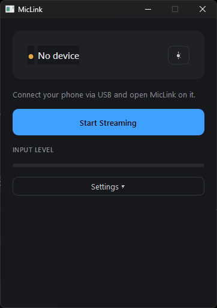
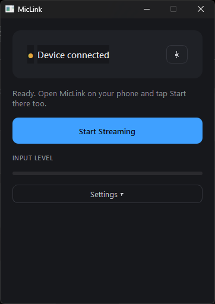

# MicLink

Turn your Android phone into a USB microphone for your PC — no WiFi setup, no cloud, no accounts, nothing ever leaves your USB cable.

---

## What you need before you start

Do this REQUIRED things first. MicLink won't work without them.

### 1. Android Platform Tools (adb) (REQUIRED)

This lets your PC talk to your phone over USB.

- **Download:** https://developer.android.com/tools/releases/platform-tools
- Download **"SDK Platform-Tools for Windows"**, extract the ZIP to a permanent folder (e.g. `C:\platform-tools`).
- Add that folder to your system PATH:
  Windows key → type `env` → **Edit the system environment variables** → **Environment Variables** → select **Path** → **Edit** → **New** → paste the folder path → OK through everything.
- Open a **new** terminal and run `adb version` to confirm it worked.

### 2. VB-Audio Virtual Cable (REQUIRED)

This creates the actual virtual microphone your other apps (Discord, Zoom, OBS, etc.) will use.

- **Download:** https://vb-audio.com/Cable/
- Extract the ZIP, right-click `VBCABLE_Setup_x64.exe` → **Run as administrator** → **Install Driver**.
- **Reboot your PC afterward** — (REQUIRED), the new audio device won't appear until you restart.
- macOS users: use **BlackHole** instead — https://existential.audio/blackhole/

### 3. Enable USB debugging on your phone (REQUIRED)

- Settings → **About phone** → tap **Build number** 7 times.
- Settings → **Developer options** → enable **USB debugging**.
- Plug your phone into your PC, and tap **Allow** on the "Allow USB debugging?" prompt that appears on your phone (check "Always allow from this computer" first).

---

## Installing MicLink

1. Grab the latest **`MicLink.exe`** and **`app-release.apk`** from the **[Releases](../../releases)** page.
2. **Phone:** transfer `app-release.apk` to your phone (email, USB, cloud drive, whatever's easiest) and tap it to install. You'll need to allow "install unknown apps" for whichever app you used to open it — Android will prompt you for this automatically the first time.
3. **PC:** just double-click `MicLink.exe`. No installer needed it's just a single portable file. (Want it searchable in your Start Menu like a normal app? See the shortcut steps at the bottom of this README.)

---

## Screenshots

### PC App

| | | |
|---|---|---|
|  |  |  |

### Phone App

| | | |
|---|---|---|
|  |  |  |

## Using it

1. Plug your phone into your PC.
2. Open **MicLink** on your PC — status should show "Device connected" within a couple seconds.
3. Click **Start Streaming** on the PC.
4. Open **MicLink** on your phone, tap **Start**.
5. Both sides should show "Streaming" within a second or two.
6. In whatever app you're using, select **CABLE Output** (Windows) / **BlackHole 2ch** (macOS) as the microphone:
   - **Discord:** Settings → Voice & Video → Input Device
   - **Zoom:** Settings → Audio → Microphone
   - **OBS:** Sources → Add → Audio Input Capture

That's it. Now your phone's mic now works as your PC's microphone.

---

## Make the PC app searchable in Start Menu (optional)

1. Right-click `MicLink.exe` → **Create shortcut**.
2. Cut that shortcut and paste it into:
   ```
   %APPDATA%\Microsoft\Windows\Start Menu\Programs
   ```
3. Now searching "MicLink" from the Start Menu finds it like any installed app.

---

## Troubleshooting*

**PC app says "No virtual audio cable found"**
Revisit the VB-Cable step above — specifically, make sure you ran the installer as administrator, and rebooted afterward. Both are easy to miss and both are required.

**Phone shows as "unauthorized"**
Look at your phone's screen — the "Allow USB debugging?" prompt is probably waiting there. Unlock your phone and tap Allow.

**PC app can't find `adb`**
Confirm `adb version` works from a terminal. If it doesn't, revisit the PATH setup step above, then fully close and reopen MicLink.

**No sound reaching Discord/Zoom/etc.**
Double-check you selected **CABLE Output**, not **CABLE Input** — Input is what MicLink writes to, Output is what other apps should read from.

**Audio cuts out or sounds glitchy**
Usually a USB cable or port issue — try a different (data-capable, not charge-only) cable, or a different port.

**Windows SmartScreen warns about `MicLink.exe`**
This is common for small independent apps without an expensive code-signing certificate — it doesn't mean anything is wrong. MicLink is fully open source; you can read exactly what it does in this repository, or build it yourself from source if you'd rather not run the pre-built binary. Click "More info" → "Run anyway" if you're satisfied it's what you expect.

**Something else not listed here**
Open an [issue](../../issues) on this repo with what you're seeing.

---

## Privacy

See [PRIVACY_POLICY.md](PRIVACY_POLICY.md) — short version: your audio never leaves the USB cable between your phone and your PC. No cloud, no accounts, no analytics.

## Building from source

Prefer to build it yourself instead of running the pre-built release? Contact me at my [socials](https://xmoke.is-a.dev)

## Changelog

See [CHANGELOG.md](CHANGELOG.md) for what's changed release to release.

## License

MIT — see [LICENSE](LICENSE).
